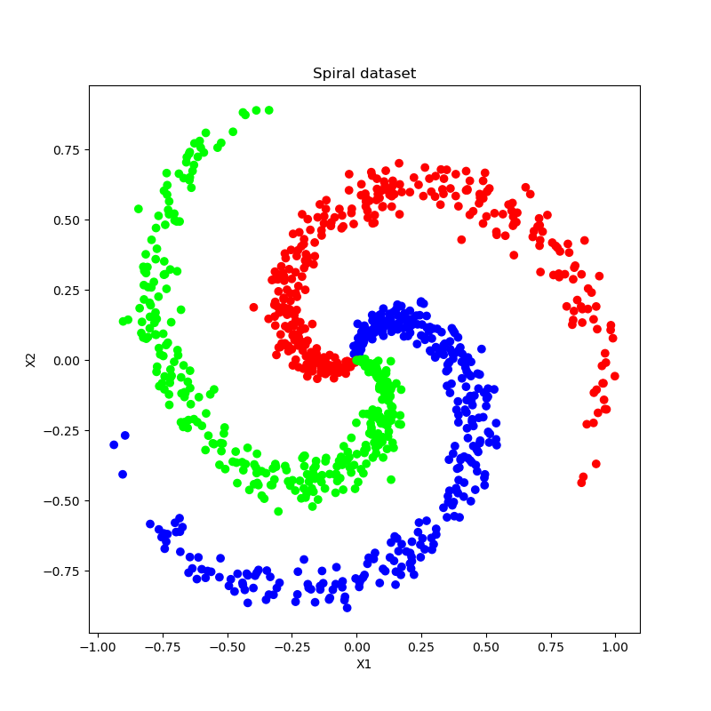
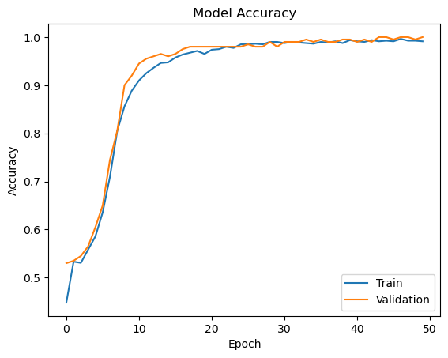
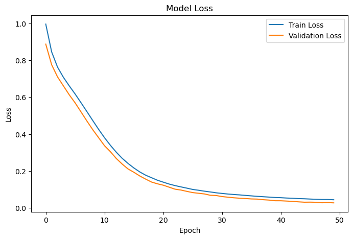
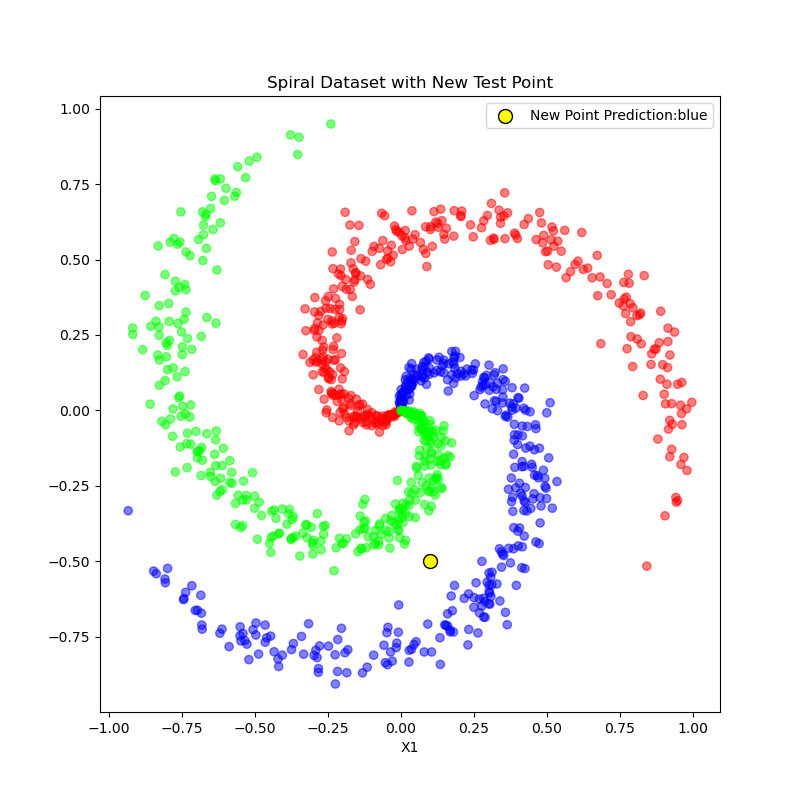

# Spiral Classification using TensorFlow

## Overview

This project demonstrates multiclass classification on a synthetic spiral dataset using a neural network built with TensorFlow and Keras.

The spiral dataset is a classic non-linear classification problem where three classes are arranged in intertwined spiral patterns. A simple linear model cannot separate these classes effectively, making it a good example for understanding how neural networks learn complex decision boundaries.

---

## Project Workflow

1. Generate a synthetic spiral dataset.
2. Split the data into training and testing sets.
3. Standardize features using StandardScaler.
4. Build a neural network using TensorFlow/Keras.
5. Train the model on the training data.
6. Monitor training and validation performance.
7. Analyze accuracy and loss curves.
8. Predict the class of new unseen data points.

---

## Technologies Used

* Python
* NumPy
* Matplotlib
* Scikit-Learn
* TensorFlow / Keras

---

## Dataset Visualization

The synthetic spiral dataset used for training.

---

## Model Accuracy

Training and validation accuracy across epochs.

---

## Model Loss

Training and validation loss across epochs.

---

## Key Concepts Practiced

* Neural Networks
* Dense Layers
* Activation Functions
* Softmax Classification
* Multiclass Classification
* Feature Scaling
* Model Training and Evaluation
* Accuracy and Loss Analysis
* Overfitting and Generalization

---

## Results

The trained neural network successfully learned the underlying patterns in the dataset and demonstrated strong predictive performance.

A key part of the project involved evaluating the model on unseen data that was not used during training. The model was able to generate accurate predictions on these new samples, indicating good generalization capability and showing that it learned meaningful patterns rather than simply memorizing the training data.

---

## Note

This project was implemented as part of my deep learning learning journey while exploring TensorFlow and neural networks.
