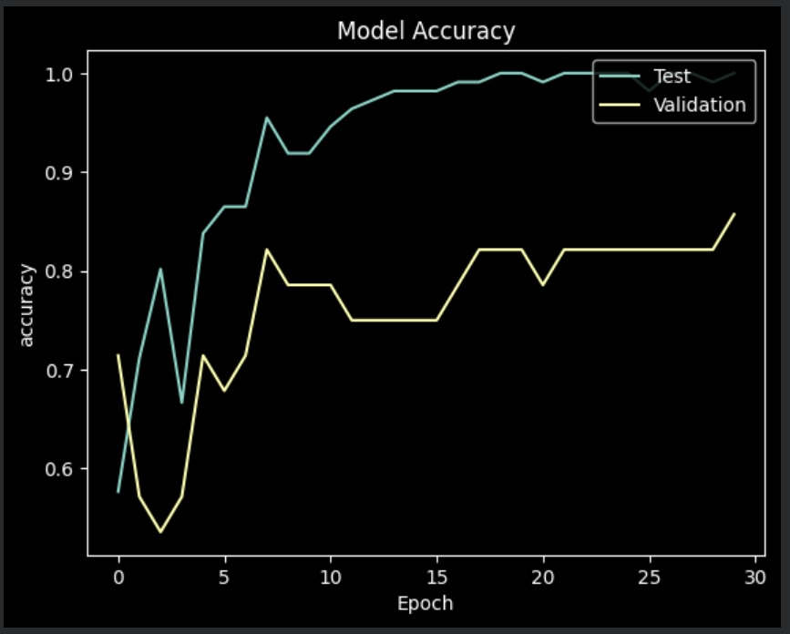
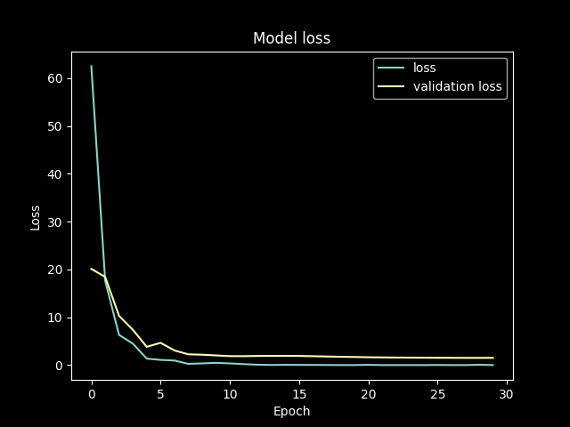

#  Brain Tumor Detection using Deep Learning

## Introduction

Brain tumors are among the most critical neurological disorders, and early diagnosis is essential for effective treatment. Manual interpretation of MRI scans requires expertise and can be time-consuming.

In this project, I built a Convolutional Neural Network (CNN) using TensorFlow/Keras to classify MRI brain scans as either containing a tumor or not. The model was trained on a publicly available dataset and deployed through a Gradio application for easy interaction.

The project covers the complete deep learning workflow, including:

- Data preprocessing
- Image classification using CNNs
- Model training and evaluation
- Testing on unseen MRI scans
- Deployment using Gradio

---

## Dataset

The dataset used for this project is the **Brain MRI Images for Brain Tumor Detection** dataset available on Kaggle.

🔗 **Dataset Link:** [Brain MRI Images for Brain Tumor Detection](https://www.kaggle.com/datasets/navoneel/brain-mri-images-for-brain-tumor-detection)

### Dataset Structure

The dataset contains two classes:

- **Yes** → MRI images containing brain tumors
- **No** → MRI images without brain tumors

All images were resized to **128 × 128** before training.

---

## Project Workflow

### 1. Data Preprocessing

- Loaded MRI images from tumor and non-tumor folders
- Resized all images to 128 × 128 pixels
- Converted images into NumPy arrays
- Applied One-Hot Encoding to class labels
- Split the dataset into training and testing sets

---

### 2. Model Architecture

The model is a Convolutional Neural Network (CNN) built using TensorFlow/Keras.

Architecture Components:

- Convolution Layers (Conv2D)
- Batch Normalization
- Max Pooling Layers
- Dropout Layers
- Global Average Pooling Layer
- Dense Layers
- Softmax Output Layer

The model is trained using:

- Loss Function: Categorical Crossentropy
- Optimizer: Adamax
- Metric: Accuracy

---

### 3. Model Training

The model was trained on MRI images to learn visual patterns associated with brain tumors.

Training included:

- Validation monitoring
- Hyperparameter tuning
- Overfitting reduction using Dropout and Batch Normalization
- Testing on unseen MRI images

---

## Results

### Accuracy Curve



### Loss Curve



### Training and Testing Results

- Training Accuracy: **100.00%**
- Validation Accuracy: **85.71%**
- Training Loss: **0.0056**
- Validation Loss: **1.5168**

The model successfully learned meaningful patterns from MRI scans and achieved strong performance on unseen validation data.

---

## Testing on Unseen Images

The trained model was tested on MRI scans that were not used during training.

Example Predictions:

- Tumor Detected
- No Tumor Detected

The model also provides confidence scores for predictions.

---

## Deployment

A simple web application was created using **Gradio**.

Features:

- Upload MRI image
- Predict tumor presence
- Display prediction result
- User-friendly interface

---

## Technologies Used

- Python
- NumPy
- Pandas
- Matplotlib
- Scikit-Learn
- TensorFlow / Keras
- Pillow (PIL)
- Gradio

---

## Repository Structure

```text
02-Brain-Tumor-Detection
│
├── brain_tumour_detection.ipynb
├── Model_accuracy_curve.jpeg
├── Model_loss_curve.png
└── README.md
```

---

## Key Learnings

Through this project, I gained practical experience in:

- Image preprocessing
- Convolutional Neural Networks (CNNs)
- Model evaluation and validation
- Handling overfitting
- Deep Learning deployment using Gradio
- Testing models on unseen data

---

## Conclusion

This project demonstrates the application of Deep Learning in medical image analysis by classifying MRI brain scans as Tumor or No Tumor. Through a CNN-based approach and an interactive Gradio interface, the project highlights how AI can assist in healthcare-related image classification tasks.